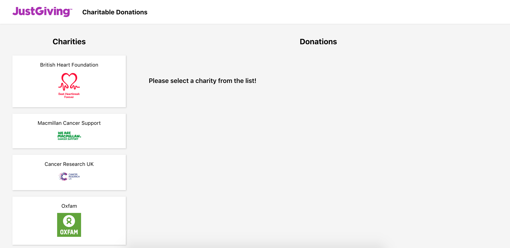
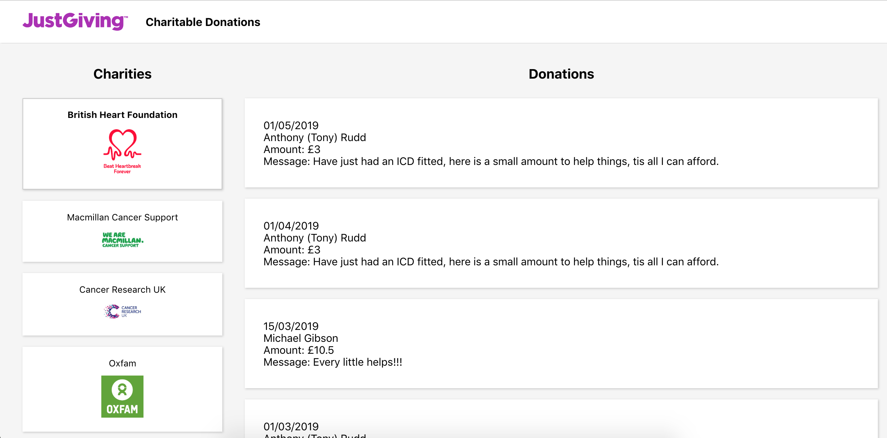

# App to display the latest donations for a selection of charities

### Key points:
- Focus on Clean, Modular, Dry code
- Commented in areas of complexity to try and help readability
- Used CRA for speed and familiarity, happy to answer questions about webpack config etc if needed.
- Loading, error and component render states give user feedback for async calls
- Added some basic UI/UX bits such as hover states and a few others
- Created stub data for charities from Curl commands
- Had a go at making it look nice in the absence of a spec (screenshots below)
- Some basic error handling in api

Note: I decided to instantiate the app with no charity pre-selected, giving the user the choice between all of them. In the case you find this doesn't meet the criteria stated in "Getting Started #2":
There is a commented line in the `pageContainer` within `componentDidMount` that simply needs to be reincluded and the app will render with British Heart Foundation preselected.

### File structure:
- Containers, Components -> inc scss files + tests
- Styling uses SASS
- Public - Nothing special here, but you might recognise the favicon ;)
- Util - `api.js` Used to separate API concerns
- Config - Includes Api endpoints and appId. Would add env variables here if we were to push the app through a _proper_ deployment process.

### Global styles:
- Reusable variables and mixins found in `variables.scss`
- Nesting for readability.
- Note: Would consider something like a BEM type approach to naming for consistency if this were a larger app.

### Things I'd have done with more time:
- Improve testing coverage
- More reusable loading UI
- Move charities data from container to component and add to state using **Hooks**
- Mobile first/responsive design

## Screenshots:

### 1. No charity pre-selected:

### 2. View showing donations with British Heart Foundation selected:

## To run:

### `npm i`

### `npm start`
