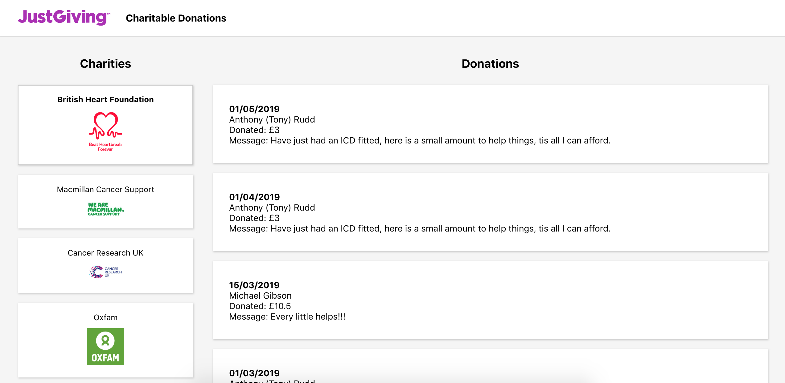

Used CRA for speed, happy to answer questions about webpack config etc.

I decided to instantiate the app with no charity pre-selected, giving the user the choice between all of them. In the case you find this doesn't meet the criteria stated in "Getting Started #2":
There is a commented line in the `pageContainer` within `componentDidMount` that simply needs to be reincluded and the app will render with British Heart Foundation preselected.

Testing coverage would be improved with more time.

## Screenshots:

### 1. No charity pre-selected:

### 2. View showing donations with British Heart Foundation selected:

## To run:

### `npm i`

### `npm start`
